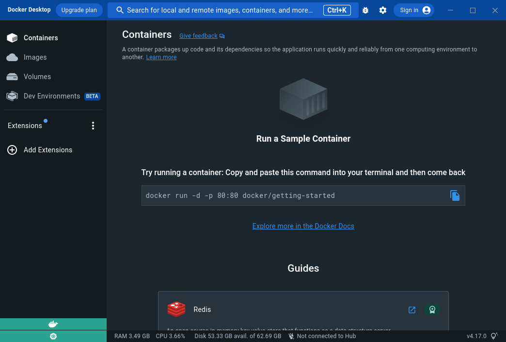
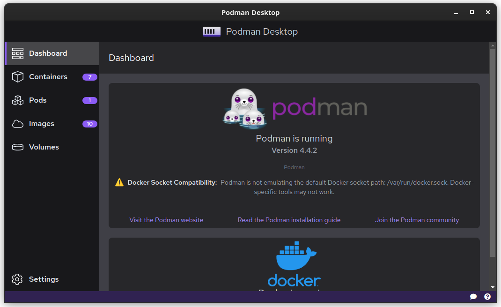

# podman-demo

## Introduction
Hi! We're Emil and Pierre, and today you'll learn about podman, the open source alternative to Docker.

## What is podman?
Podman is a daemonless container engine for developing, managing, and running OCI Containers on your Linux System. Containers can either be run as root or in rootless mode. Simply put, podman is a tool to help you run containers on your system.

## Why use podman?
While podman is feature compatible with Docker, it also provides some extra features aimed at developers, like Kubernetes integration. Podman is also the default container engine for Fedora, and is available on most Linux distributions. 
Podman Desktop is also available for Windows and Mac, and uses a lightweight virtual machine to run containers instead of the proprietary Docker Desktop. 

## Replacing docker with podman
### Containers
Just like with Docker, we will create our container using a Dockerfile. To be more compliant with the OCI standard, we will however use a Containerfile, which has the same syntax as a Dockerfile.

**see Containerfile**

To build execute this, we can then use similar commands as with docker.

`podman build . --tag devops:nginx`
`podman run -p 8082:8080 devops:nginx`

**Check your browser at localhost:8080**

Now let's tear down the container.

`podman ps`
`podman stop <container-id>`

### Compose
Podman also supports docker-compose files, so we can use the same docker-compose.yml file as with Docker.

`podman-compose up` 

### K8s resources
Kubernetes resources (deployments, services, pods, and more) can run locally using podman. This allows you to run resources locally without having to use a cluster.

`podman play kube deployment.yml`

or rebuild:

`podman play kube deployment.yml --replace --build`

## Comparing desktop GUI offerings

| Docker Desktop | Podman Desktop |
| --- | --- |
| Docker Desktop is a proprietary product, and is only available for Windows and Mac. | Podman Desktop is open source, and is available for Linux, Windows and Mac. |
| Docker Desktop uses a proprietary virtualization technology called Hyper-V. | Podman Desktop uses a lightweight virtual machine called Podman Machine. |
| Docker Desktop is free for personal use, but requires a paid subscription for commercial use. | Podman Desktop is free for personal and commercial use. |
| Docker Desktop is in beta for Linux. | Podman Desktop is available natively for Linux. |

## Conclusion

